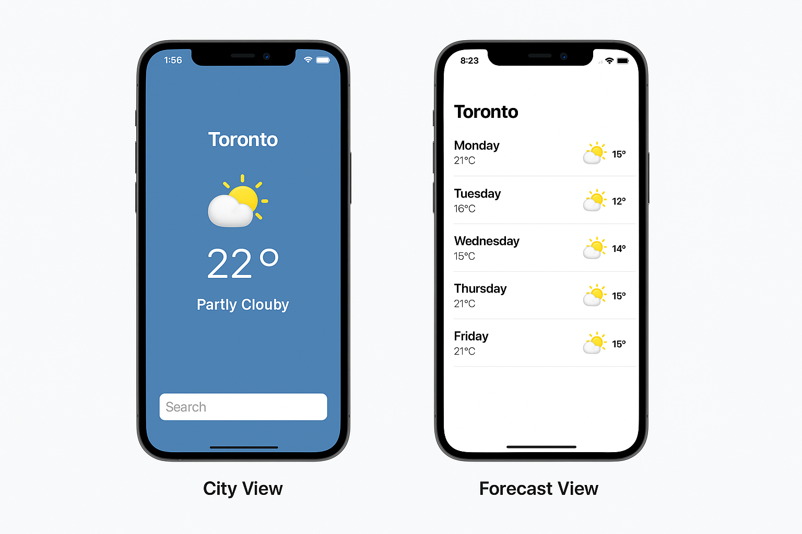

# WeatherCast 🌤️

An iOS weather app built using **UIKit**, fetching real-time weather data and 5-day forecasts using the **OpenWeather13 API (via RapidAPI)**. <br>
The app supports city search with autocomplete, displays current weather and provides a clean forecast interface using custom Collection and Table View Cells.

## 📱 Features

- 🌆 Search cities with live autocomplete (GeoBytes API)
- 📡 Get current weather with temperature, condition and icon
- 📍 Fetch 5-day forecast using city’s latitude and longitude
- 🧩 Custom collection view for saved cities
- 📅 Table view with forecast (formatted date + temp)
- 🖼️ Weather icons from OpenWeather
- 🧪 Error handling for invalid cities
- 💾 Persistence using property list (Core Data structure)
- ❌ Delete cities and refresh on launch
- 🔄 Forecast updates on detail view open

## 🧱 Project Structure

```
WeatherAppDemo/
│
├── Controllers/
│   ├── CityCollectionViewController.swift
│   ├── CityWeatherDetailViewController.swift
│   ├── SearchCityViewController.swift
│   └── WeatherController.swift
│
├── Models/
│   ├── CityWeather.swift
│   ├── ForecastDay.swift
│   └── PersistenceController.swift
│
├── Views/
│   ├── CityCollectionViewCell.swift
│   └── ForecastTableViewCell.swift
│
├── Assets.xcassets/         # Weather icons
├── Main.storyboard          # UI layout
└── Info.plist               # API permission
```

## 🛠️ Technologies

- UIKit (Storyboard-based)
- Swift 5
- Core Data for persistence
- RapidAPI: `open-weather13` (current + forecast)
- GeoBytes for city autocomplete

## 🚀 Setup

1. Clone the repo and open in Xcode.
2. Add your RapidAPI key in `WeatherController.swift`
3. Run on Simulator or device

## 🔐 API Usage

- `GET /city/{city},{country}` - Get current weather + lat/lon
- `GET /city/fivedaysforcast/{lat}/{lon}` - Get 5-day forecast

## 📸 Screenshots

_Screenshots of city list view and forecast detail here._  

```markdown


```

---
